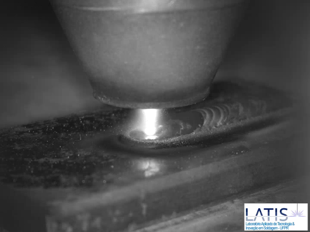
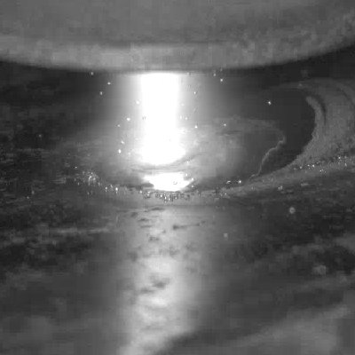

# TEMPORAL CONVOLUTIONAL NEURAL NETWORK

## Dependencies
Python 3.12.8

## Datasets
### Raw Data
Unedited videos presenting the depoistion of 9 DED-PTA experiments following the taguchi DOE and a reference video to ease camera positioning setup

Experiment   | Current [A] | Nozzle Speed [mm/min] | Mass Flow Rate [g/min]
:--: | :--: | :--: | :--:
L1   | 120  | 60   | 10
L2   | 160  | 60   | 15
L3   | 200  | 60   | 20
L4   | 120  | 80   | 10
L5   | 160  | 80   | 15
L6   | 200  | 80   | 20
L7   | 120  | 100  | 10
L8   | 160  | 100  | 15
L9   | 200  | 100  | 20

Source: [pta_taguchi_raw_videos.zip](https://leofernanndes-datasets.s3.us-east-1.amazonaws.com/ded-pta/20251128/pta_taguchi_raw_videos.zip) ~ 264 MB

### 400x400 Pixels Cropped Images

Processed images extracted from deposition videos. 

The original videos were converted to .png images and cropped as 400x400 pixels images centered on the melt pool region.

Source: [experimentos_taguchi_400p_cropped_images.zip](https://leofernanndes-datasets.s3.us-east-1.amazonaws.com/ded-pta/20251128/experimentos_taguchi_400p_cropped_images.zip) ~ 2.3 GB
